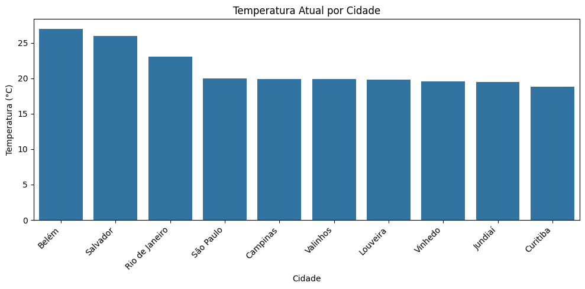

# Análise de Clima em Tempo Real — API OpenWeather

Projeto de coleta e visualização de dados climáticos em tempo real, utilizando **Python**, a **API do OpenWeather**, e a biblioteca **Pandas**.

## 📊 Sobre o projeto

Diferente de projetos baseados em datasets estáticos (arquivos CSV prontos), este projeto coleta dados climáticos **ao vivo**, diretamente de uma API pública, demonstrando como automatizar a extração de dados de fontes externas.

O script consulta a temperatura atual, sensação térmica, umidade e descrição do clima de 10 cidades brasileiras, organiza os resultados em uma tabela e gera uma visualização comparativa.

## 🎯 O que o projeto demonstra

- Consumo de uma API REST pública com a biblioteca `requests`
- Requisições em loop para múltiplas cidades
- Tratamento de dados em formato JSON (estruturas aninhadas)
- Organização dos resultados em um DataFrame (Pandas)
- Visualização comparativa com Matplotlib/Seaborn
- **Boas práticas de segurança:** a chave de API não fica exposta no código — é carregada de forma segura por meio de uma variável de ambiente (arquivo `.env`, que não é enviado ao repositório)

## 🛠️ Ferramentas utilizadas

- **Python** — linguagem principal
- **Requests** — consumo da API
- **Pandas** — organização dos dados
- **Matplotlib / Seaborn** — visualização
- **python-dotenv** — gerenciamento seguro da chave de API

## ⚙️ Como rodar este projeto

1. Clone o repositório
2. Instale as dependências: `pip install requests pandas matplotlib seaborn python-dotenv`
3. Crie uma conta gratuita em [openweathermap.org](https://openweathermap.org/) e gere sua própria chave de API
4. Crie um arquivo `.env` na raiz do projeto com o conteúdo:
   ```
   OPENWEATHER_API_KEY=sua_chave_aqui
   ```
5. Rode o notebook `notebooks/analise_clima.ipynb`

## 📈 Resultado

O gráfico abaixo mostra a temperatura atual das cidades consultadas no momento da execução do script (os valores mudam a cada nova execução, já que os dados são coletados em tempo real):



## 📁 Estrutura do repositório

- `notebooks/analise_clima.ipynb` — notebook completo com a coleta e análise
- `images/temp_atual.png` — gráfico gerado a partir de uma coleta
- `README.md`

**Observação:** o arquivo `.env` (contendo a chave de API pessoal) não está incluído no repositório, por questões de segurança. Cada pessoa que for rodar o projeto deve gerar sua própria chave gratuita.
